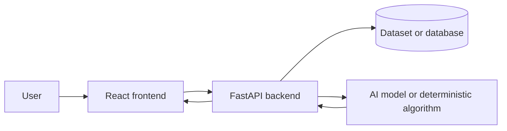

# Architecture Template

```mermaid
flowchart LR
  U[User] --> F[React frontend]
  F --> A[FastAPI backend]
  A --> D[(Dataset or database)]
  A --> M[AI model or deterministic algorithm]
  M --> A
  A --> F
```

## Contract
- Frontend input/output:
- Backend endpoints:
- External APIs:
- Secrets and privacy:
- Deployment target:
- Fallback if external service fails:
